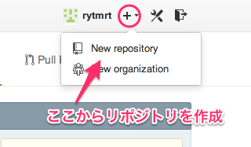
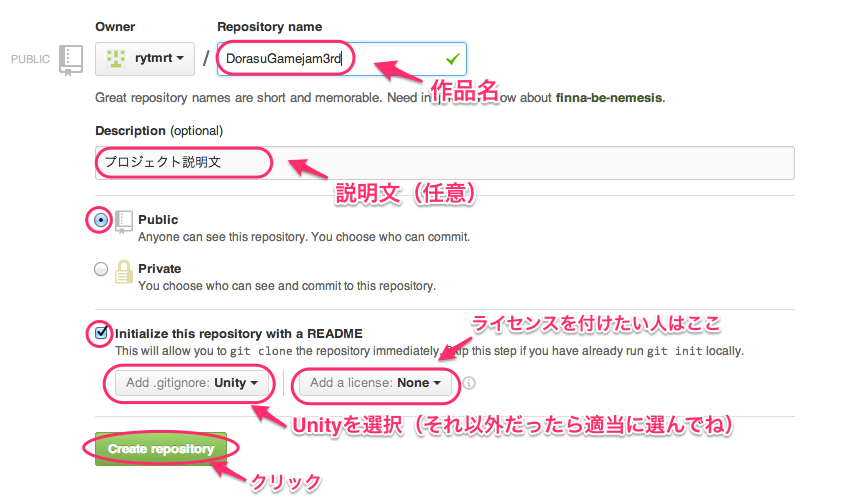
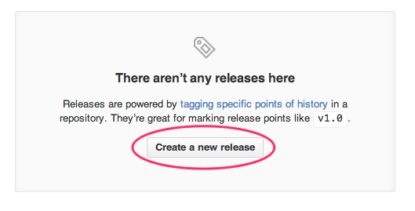
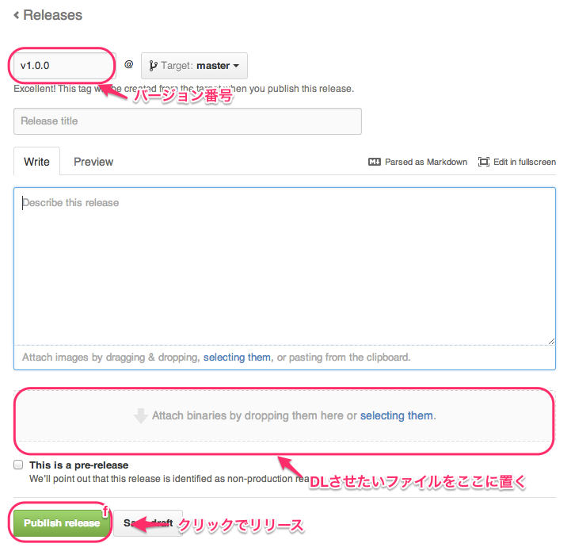

Githubの使い方
====================

Githubの使い方を説明します。

リポジトリの作り方
--------------------

[Githubのトップ](https://github.com)にアクセスして、＋ボタンから[New reoisitory]をクリック

必要事項を入力して[Create reoisitory]をクリック

これでリポジトリが完成！

リポジトリにアップする方法
--------------------

GitクライアントのSourceTreeを使ってアップロードを行います。
詳しくは[こちら](http://tryworks-design.com/?p=1589)

リリース（ダウンロード）の作成方法
--------------------

Githubのリポジトリページへ移動し、「releases」をクリック

[Create a new release]をクリック

バージョン番号を入力してDLさせたいファイルをドラッグで追加すればリリースに登録完了

